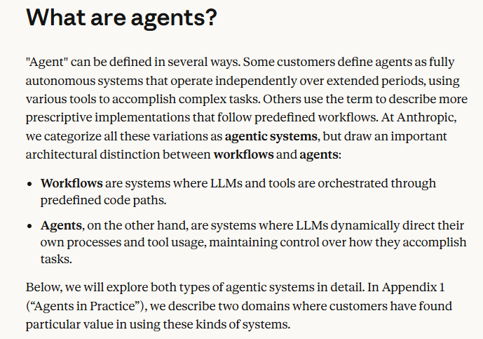
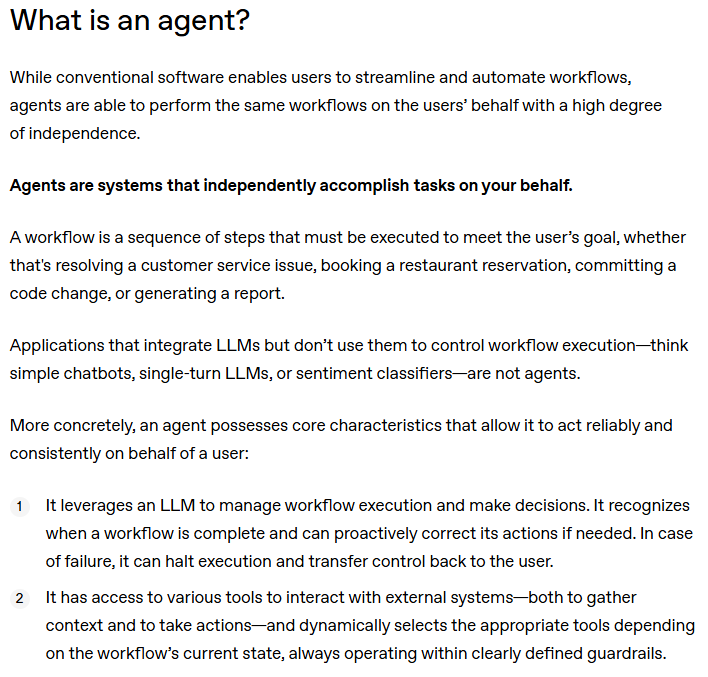

这四个概念常常出现在大模型应用开发中，容易混淆。简单来说，它们的**自主性**和**复杂度**依次递增：从被动回答，到固定流程，再到自主决策，最后是多个智能体协作。

---

### 1. Chatbot（聊天机器人）
**核心：对话交互界面，一问一答**

- 最典型的形态就是“你问，它答”，比如客服机器人、ChatGPT 的基础对话模式。
- 依赖大语言模型生成回复，可能带有多轮记忆，但**没有主动规划或调用外部工具**的能力。
- 它的“智能”体现在语言理解和生成上，但不会自己分解任务、分步骤去做事。

> 📌 例子：你问“推荐一家附近好吃的川菜馆”，它能根据知识给出建议，但不会自动打开地图搜索你的位置、实时查询餐厅评分。

---

### 2. Workflow（工作流）
**核心：预定义的固定流程，确定性编排**

- 把大模型调用、工具、数据处理等步骤，像流水线一样串起来。
- 流程是**开发者事先设计好的**，每步执行什么非常明确，可能包含条件分支，但整体路径是确定的。
- 优点是可控、可预测，常用于重复性任务。

> 📌 例子：一个“合同审查”工作流——  
> 1. 读取上传的 PDF  
> 2. 提取关键条款  
> 3. 调用法律条款库做比对  
> 4. 用大模型生成风险提示  
> 每次都是严格按这个顺序执行，不会自己变出新的步骤。

---

### 3. Agent（智能体）
**核心：自主规划，动态决策，会使用工具**

- Agent 具备**思考-行动-观察**的循环，能根据目标自己决定下一步做什么。
- 它会调用外部工具（搜索、代码执行、API 等），并根据反馈调整计划，直到任务完成。
- 流程不是固定的，而是**由模型自己动态生成**，因此能处理更开放、复杂的任务。

> 📌 例子：你告诉 Agent “帮我做一个关于新能源汽车的竞品分析报告”。  
> 它会自己规划：先搜索最新新闻 → 找到几个主要品牌 → 查询销量数据 → 总结技术路线 → 生成 PPT 提纲。如果中间缺数据，它会换关键词再查，而不是按预设流程死板执行。

---

### 4. Multi-agent（多智能体）
**核心：多个 Agent 分工协作，模拟团队工作**

- 一个系统中有多个 Agent，每个通常有独立的角色、指令和工具集。
- 它们通过对话或消息进行协作、竞争或交接任务，能处理更复杂的、需要多视角的问题。
- 可以有人类参与，例如某个 Agent 负责和用户确认关键决策。

> 📌 例子：一个“软件项目规划”多智能体系统——  
> - 产品经理 Agent：拆解需求  
> - 架构师 Agent：设计系统架构  
> - 开发 Agent：估算工期与风险  
> - 测试 Agent：生成测试用例  
> 它们互相提问、讨论，最后整合出一份完整的项目计划。

---

### 四者对比速览表

| 维度 | Chatbot | Workflow | Agent | Multi-agent |
|------|---------|----------|-------|-------------|
| **控制流** | 被动响应 | 固定、预定义 | 动态自主规划 | 多实体协商、动态交互 |
| **工具使用** | 通常无 | 在固定节点使用 | 自主决定何时用什么工具 | 各 Agent 有各自工具，可互相借用 |
| **决策方式** | 无复杂推理 | 条件分支（预设） | 基于目标自主推理 | 分布式决策，可能有角色分工 |
| **任务类型** | 简单问答、闲聊 | 可重复的标准化流程 | 开放目标、复杂多步任务 | 跨领域、需多角度协作的复杂任务 |
| **实现复杂度** | 低 | 中 | 高 | 很高 |

---

### 它们之间不是“谁替代谁”，而是可以组合
- **Chatbot 是界面，Agent 是大脑**：你可以给一个聊天机器人背后配上 Agent 能力，让它能帮你订机票，而不仅仅是聊天。
- **Agent 内部可以用 Workflow**：Agent 在规划时，发现某一步是固定流程（如报告生成），可以直接调用一个 Workflow 来稳定执行。
- **Multi-agent 包含多个 Agent**：是整个系统的高级协作形态。

从技术演进看，确实存在 **Chatbot → Workflow → Agent → Multi-agent** 这样自主性逐步增强的路径，但在真实系统中，它们常被混合使用，以兼顾灵活性和可控性。

如果你正在做技术选型，不妨从任务特点出发：是固定流程，就选 Workflow；需要灵活探索，用 Agent；多个专业角色协同，再上 Multi-agent。