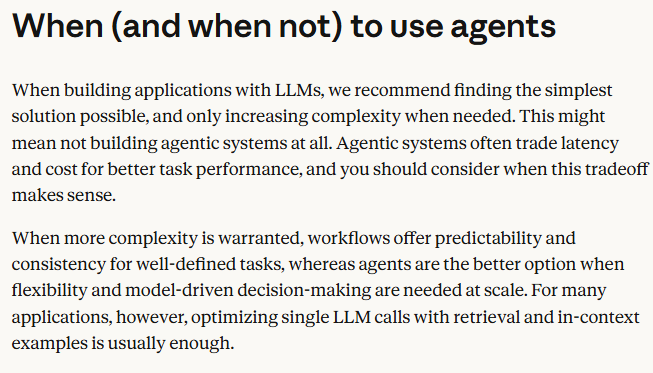
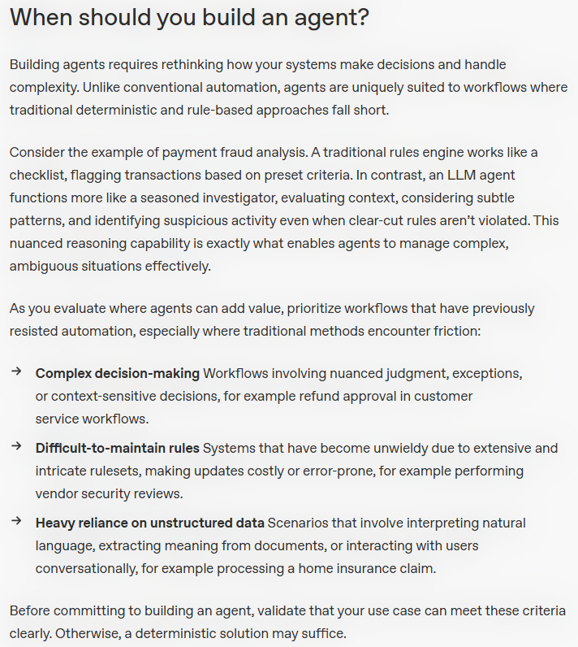

要判断你的场景是否需要 **Agent** 而不是普通 **Workflow**，可以从你提供的两份材料中提炼出几个关键决策维度。

先直接说结论：  
**当你的任务需要动态推理、处理非结构化信息、或应对不断变化的规则/例外时，Agent 更合适；当任务步骤固定、规则清晰、可预先穷举时，普通 Workflow 就足够，甚至更好。**

下面是具体的判断框架，结合你提供的资料整理而成：

---

### 一、什么情况下普通 Workflow 就够了？
- ✅ 步骤明确、顺序固定（如：提交表单 → 验证格式 → 存数据库）
- ✅ 逻辑可以用 `if/else`、规则引擎、状态机清晰表达
- ✅ 输入/输出结构稳定（如：固定字段的 JSON）
- ✅ 对延迟和成本敏感，不需要额外推理开销
- ✅ 错误类型可枚举，有确定的补偿/重试路径

👉 **此时不要用 Agent**。材料第二点明确说：“agentic systems often trade latency and cost for better performance”。

---

### 二、什么情况下需要 Agent？
根据第一份材料，优先考虑 Agent 的场景包括：

#### 1. **复杂决策 / 需要判断与例外处理**
- 例如：客服退款审核 —— 不是“金额大于1000就拒绝”，而是要看用户历史、语气、订单上下文、甚至模糊的“特殊情况”。
- Agent 可以像“资深调查员”一样综合判断，而不是走固定分支。

#### 2. **规则难以维护或频繁变动**
- 例如：供应商安全审核 —— 不同行业、不同等级供应商适用不同规则，且规则本身在变化。
- 用 Workflow 会变成巨型 if-else 或规则表，修改成本高、易出错。
- Agent 可以直接理解政策文本并结合具体案例做判断。

#### 3. **大量非结构化数据**
- 例如：处理房屋保险理赔 —— 需要读懂用户叙述、维修单扫描件、聊天记录、照片描述等。
- Workflow 很难提前定义所有信息提取路径；Agent 可以动态决定要看哪段、问什么、怎么得出结论。

#### 4. **需要模型驱动决策，且无法预设路径**
- 例如：欺诈分析、意向识别、模糊匹配。
- 材料中对比：规则引擎像“打勾清单”，Agent 像“调查员”。

---

### 三、一个快速自检表（回答这几个问题）

| 问题 | 是 | 否 |
|------|----|----|
| 我的任务是否存在大量例外情况？ | 倾向 Agent | 倾向 Workflow |
| 业务规则是否频繁变化且难以枚举？ | 倾向 Agent | 倾向 Workflow |
| 输入是否包含自然语言、图片、模糊描述？ | 倾向 Agent | 倾向 Workflow |
| 是否需要模型“理解”而不是“匹配”？ | 倾向 Agent | 倾向 Workflow |
| 对延迟和成本要求是否非常严格（<200ms）？ | 倾向 Workflow | 倾向 Agent |
| 是否能写出完整、稳定的流程图？ | 倾向 Workflow | 倾向 Agent |

---

### 四、一个可操作的结论表述（适合写到文档或对团队说明）

> **我选择 Agent 而不是普通 Workflow，是因为我的场景具备以下特征（至少其一）：**
> 1. 决策路径无法预先穷举，存在大量例外或上下文敏感判断；
> 2. 输入主要是非结构化数据（自然语言、文档、对话）；
> 3. 规则系统已经或很快会变得难以维护；
> 4. 我接受一定程度的延迟与成本上升，以换取更强的泛化能力和适应性。

> 反之，如果任务步骤固定、规则稳定、且延迟敏感，我会坚持使用普通 Workflow。

---

如果你想，我可以帮你用你**真实的一个业务场景**直接套用这个框架做一次判断。你只需要简要描述任务和输入/输出即可。
